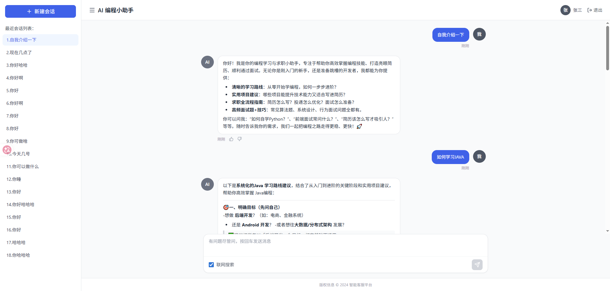

# 🤖 AI 编程小助手 - LangChain4j 实战项目（学习）

> 基于 LangChain4j + 通义千问的 AI 智能编程学习与求职辅导机器人

[](https://spring.io/projects/spring-boot)
[](https://vuejs.org/)
[](https://github.com/langchain4j/langchain4j)
[](https://www.oracle.com/java/)


大家好，我是程序员鱼皮。现在 AI 应用开发可以说是程序员必备的技能了，求职时能够大幅增加竞争力。之前我用 Spring AI 带大家做过一个 [开源的 AI 超级智能体项目](https://github.com/liyupi/yu-ai-agent)，这次我来带大家快速掌握另一个主流的 Java AI 应用开发框架 LangChain4j。

这个教程项目也是我精心设计，拒绝枯燥的理论，而是用一个编程小助手项目带大家在实战中依次学习 LangChain4j 的主流用法。看完这个教程，你不仅学会了 LangChain4j，还直接多了一段项目经历，岂不美哉？

项目视频教程：https://bilibili.com/video/BV1X4GGziEyr

文字教程：https://mp.weixin.qq.com/s/7cNh7ndeiWiHBjnkTkz_Zg （在公众号程序员鱼皮的文章）

更多鱼皮原创项目教程、编程学习路线可以在 [编程导航学习网](https://www.codefather.cn/) 获取。

⭐ 如果这个项目对您有帮助，请给鱼皮一个 Star，这会激励我继续爆肝输出更多干货教程，万分感谢！ 



本项目中，会话记忆、结构化输出、RAG、工具调用、MCP、护轨、可观测性、AI 代码生成等等，都有从 0 的讲解和实践。


## ✨ 项目介绍

### 定位
- 编程学习导师: 提供清晰的学习路线规划和个性化建议
- 求职面试助手: 涵盖简历优化、面试技巧、高频题目解析
- 代码答疑专家: 实时解答编程技术问题，提供代码示例

### 技术

#### AI 服务
- **LangChain4j集成**: 采用业界领先的AI应用开发框架
- **通义千问模型**: 基于阿里云大模型，专业可靠
- **流式响应**: 实时打字机效果，提升用户体验

#### 安全机制
- **输入安全防护**: 检测敏感内容，确保应用安全

#### 工具集成
- **RAG检索增强**: 结合本地知识库，提供精准答案
- **MCP协议支持**: 模型上下文协议，增强AI能力
- **面试题搜索**: 实时抓取最新面试题目
- **Web爬虫工具**: 获取实时技术资讯


## 🚀 快速开始

### 环境要求

- **Java**: JDK 21+
- **Node.js**: 16.0+
- **Maven**: 3.6+
- **通义千问API**: 需申请API密钥
- **Big Model API**: 需申请API密钥

### 启动步骤

#### 1. 后端启动
```bash
# 克隆项目
git clone <repository-url>
cd ai-code-helper

# 配置API密钥
# 编辑 src/main/resources/application.yml
# 填入您的通义千问 API 和 Big Model API 密钥

# 启动后端服务
mvn spring-boot:run
```

#### 2. 前端启动
```bash
# 进入前端目录
cd ai-code-helper-frontend

# 安装依赖
npm install

# 启动开发服务器
npm run dev
```

#### 3. 访问应用
- 前端地址: `http://localhost:5173`
- 后端API: `http://localhost:8081/api`


## 技术架构

```
┌─────────────────┐    ┌─────────────────┐
│   Vue.js 前端    │────│  Spring Boot   │
│   - 聊天界面     │    │    后端服务      │
│   - 实时流式     │    │   - RESTful API │
│   - Markdown    │    │   - SSE 推送     │
└─────────────────┘    └─────────────────┘
                              │
                    ┌─────────────────┐
                    │   LangChain4j   │
                    │   - AI服务层    │
                    │   - 工具集成    │
                    │   - 安全防护    │
                    └─────────────────┘
                              │
                    ┌─────────────────┐
                    │   通义千问API    │
                    │   - 对话模型    │
                    │   - 嵌入模型    │
                    │   - 流式输出    │
                    └─────────────────┘
```


## 核心模块

- `AiCodeHelperService`: 核心对话服务
- `QwenChatModelConfig`: 模型配置管理
- `RagConfig`: 检索增强配置
- `McpConfig`: 模型上下文协议

- `InterviewQuestionTool`: 面试题搜索
- `SafeInputGuardrail`: 输入安全防护
- `ChatModelListener`: 对话监听器


## 致谢

- [LangChain4j](https://github.com/langchain4j/langchain4j) - 强大的AI应用开发框架
- [阿里云通义千问](https://dashscope.aliyun.com/) - 优秀的大语言模型
- [Spring Boot](https://spring.io/projects/spring-boot) - 简化的Java开发框架
- [Vue.js](https://vuejs.org/) - 渐进式JavaScript框架

